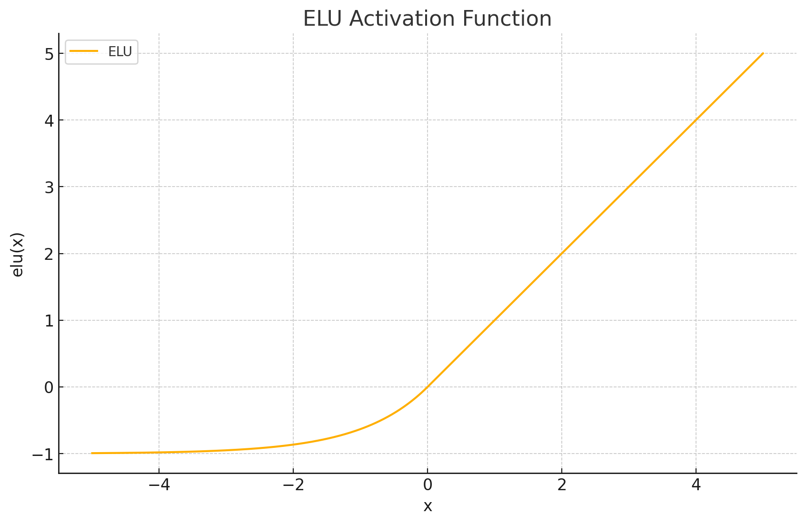
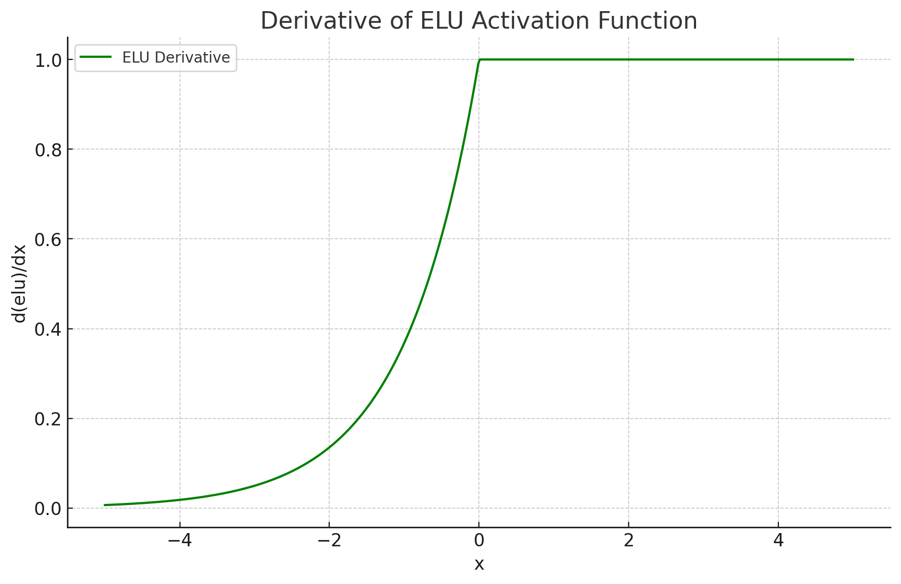

<span style="float:right;"><a href="https://github.com/RubixML/ML/blob/master/src/NeuralNet/ActivationFunctions/ELU/ELU.php">[source]</a></span>

# ELU
*Exponential Linear Units* are a type of rectifier that soften the transition from non-activated to activated using the exponential function. As such, ELU produces smoother gradients than the piecewise linear [ReLU](relu.md) function.

$$
\text{ELU}(x) =
\begin{cases}
\alpha \left(e^{x}-1\right) & \text{if } x \leq 0 \\
x & \text{if } x > 0
\end{cases}
$$

## Parameters
| # | Name | Default | Type | Description |
|---|---|---|---|---|
| 1 | alpha | 1.0 | float | The value at which leakage will begin to saturate. Ex. alpha = 1.0 means that the output will never be less than -1.0 when inactivated. |

## Size and Performance
ELU is a simple function and is well-suited for deployment on resource-constrained devices or when working with large neural networks.

## Plots




## Example
```php
use Rubix\ML\NeuralNet\ActivationFunctions\ELU\ELU;

$activationFunction = new ELU(2.5);
```

## References
[1]: D. A. Clevert et al. (2016). Fast and Accurate Deep Network Learning by Exponential Linear Units.
