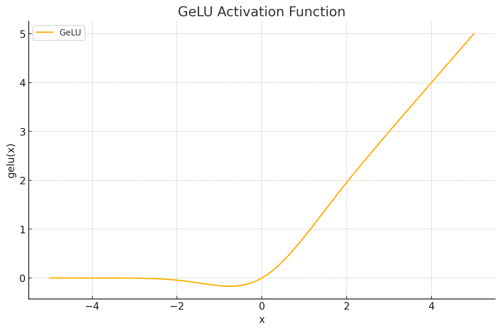
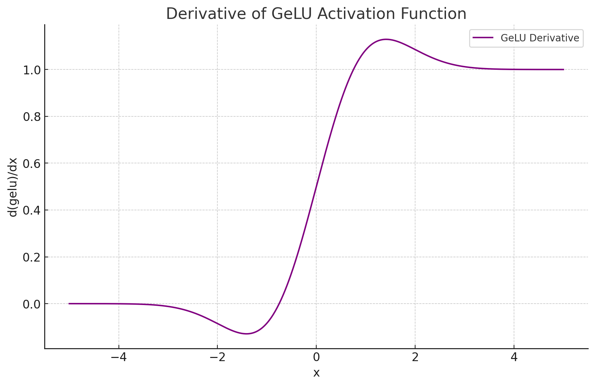

<span style="float:right;"><a href="https://github.com/RubixML/ML/blob/master/src/NeuralNet/ActivationFunctions/GELU/GELU.php">[source]</a></span>

# GELU
Gaussian Error Linear Units (GELUs) are rectifiers that are gated by the magnitude of their input rather than the sign of their input as with ReLU variants. Their output can be interpreted as the expected value of a neuron with random dropout regularization applied.

$$
\text{GELU}(x) = 0.5 \cdot x \left(1 + \tanh\left(\sqrt{\frac{2}{\pi}} \left(x + 0.044715 \cdot x^3\right)\right)\right)
$$

## Parameters
This activation function does not have any parameters.

## Plots




## Example
```php
use Rubix\ML\NeuralNet\ActivationFunctions\GELU\GELU;

$activationFunction = new GELU();
```

### References
>- D. Hendrycks et al. (2018). Gaussian Error Linear Units (GELUs).
