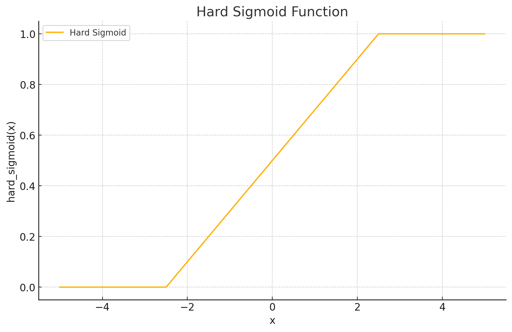
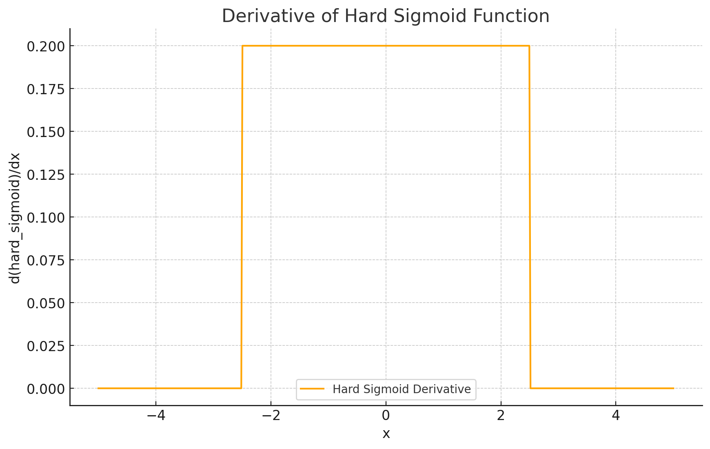

<span style="float:right;"><a href="https://github.com/RubixML/ML/blob/master/src/NeuralNet/ActivationFunctions/HardSigmoid/HardSigmoid.php">[source]</a></span>

# Hard Sigmoid
A piecewise linear approximation of the sigmoid function that is computationally more efficient. The Hard Sigmoid function has an output value between 0 and 1, making it useful for binary classification problems.

$$
\text{HardSigmoid}(x) = \max\left(0,\min\left(1, 0.2x + 0.5\right)\right)
$$

## Parameters
This activation function does not have any parameters.

## Size and Performance
Hard Sigmoid has a minimal memory footprint compared to the standard Sigmoid function, as it uses simple arithmetic operations (multiplication, addition) and comparisons instead of expensive exponential calculations. This makes it particularly well-suited for mobile and embedded applications or when computational resources are limited.

## Plots




## Example
```php
use Rubix\ML\NeuralNet\ActivationFunctions\HardSigmoid\HardSigmoid;

$activationFunction = new HardSigmoid();
```

## References
[^1]: https://en.wikipedia.org/wiki/Hard_sigmoid
