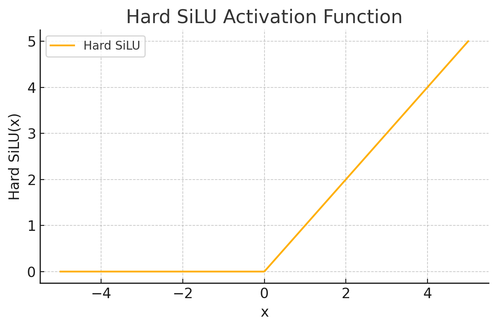
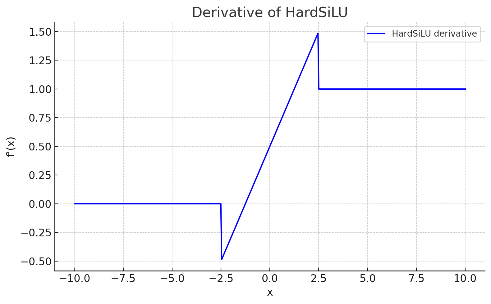

<span style="float:right;"><a href="https://github.com/RubixML/ML/blob/master/src/NeuralNet/ActivationFunctions/HardSiLU/HardSiLU.php">[source]</a></span>

# Hard SiLU

Hard Sigmoid Linear Units (Hard SiLU) are a computationally efficient variant of the SiLU activation function.

$$
\displaystyle
\text{Hard SiLU}(x) = x \cdot \text{Hard Sigmoid}(x) = x \cdot \max(0, \min(1, 0.2x + 0.5))
$$

## Parameters
This activation function does not have any parameters.

## Plots




## Example
```php
use Rubix\ML\NeuralNet\ActivationFunctions\HardSiLU\HardSiLU;

$activationFunction = new HardSiLU();
```
