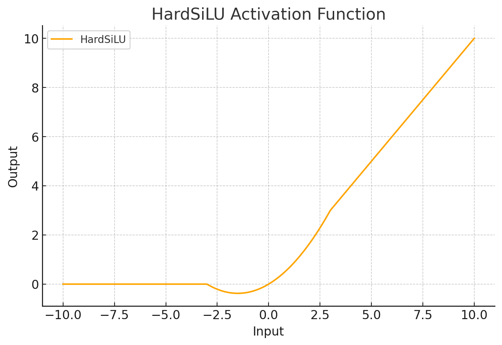

<span style="float:right;"><a href="https://github.com/RubixML/ML/blob/master/src/NeuralNet/ActivationFunctions/HardSiLU/HardSiLU.php">[source]</a></span>

# Hard SiLU

Hard Sigmoid Linear Units (Hard SiLU) are a computationally efficient variant of the SiLU activation function. They use the Hard Sigmoid function as a self-gating mechanism, making them suitable for resource-constrained environments while maintaining good performance characteristics.

$$
\displaystyle
\text{Hard SiLU}(x) = x \cdot \text{Hard Sigmoid}(x) = x \cdot \max(0, \min(1, 0.2x + 0.5))
$$

## Parameters
This activation function does not have any parameters.

## Size and Performance
Hard SiLU is designed to be computationally efficient compared to the standard SiLU (Swish) activation function. By using the piecewise linear Hard Sigmoid approximation instead of the standard Sigmoid function, it reduces the computational complexity while maintaining similar functional properties. This makes it particularly suitable for deployment on resource-constrained devices or when working with large neural networks.

## Plots



## Example
```php
use Rubix\ML\NeuralNet\ActivationFunctions\HardSiLU\HardSiLU;

$activationFunction = new HardSiLU();
```
