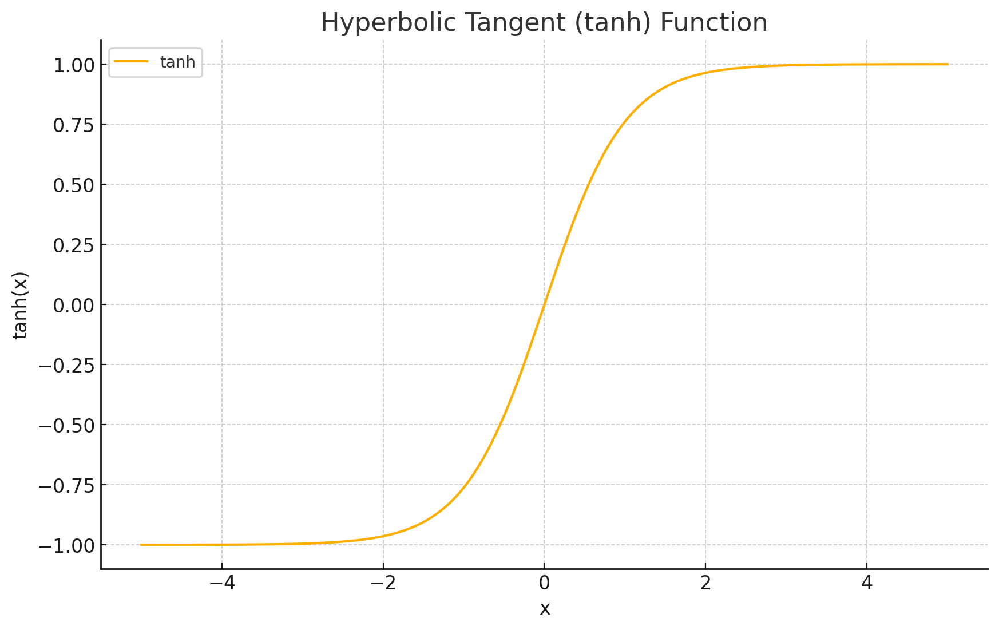
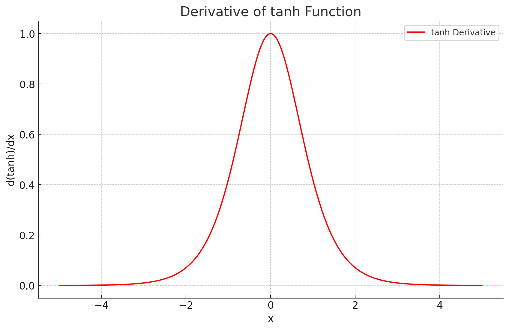

<span style="float:right;"><a href="https://github.com/RubixML/ML/blob/master/src/NeuralNet/ActivationFunctions/HyperbolicTangent/HyperbolicTangent.php">[source]</a></span>

# Hyperbolic Tangent
An S-shaped function that squeezes the input value into an output space between -1 and 1. Hyperbolic Tangent (or *tanh*) has the advantage of being zero centered, however is known to *saturate* with highly positive or negative input values which can slow down training if the activations become too intense.

$$
{\displaystyle \tanh(x)={\frac {e^{x}-e^{-x}}{e^{x}+e^{-x}}}}
$$

## Parameters
This activation function does not have any parameters.

## Size and Performance
Hyperbolic Tangent requires more computational resources compared to simpler activation functions like ReLU due to its exponential calculations. While not as computationally efficient as piecewise linear functions, it provides important zero-centered outputs that can be critical for certain network architectures, particularly in recurrent neural networks where gradient flow is important.

## Plots




## Example
```php
use Rubix\ML\NeuralNet\ActivationFunctions\HyperbolicTangent;

$activationFunction = new HyperbolicTangent();
```
