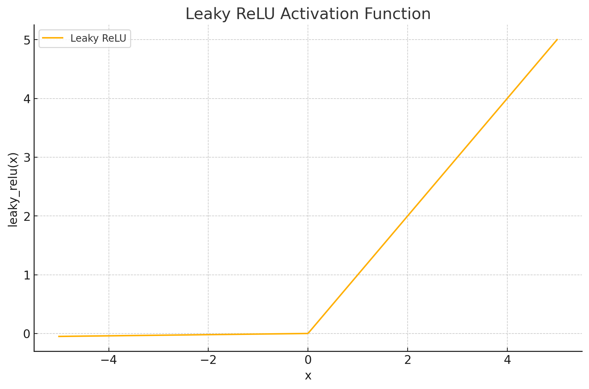
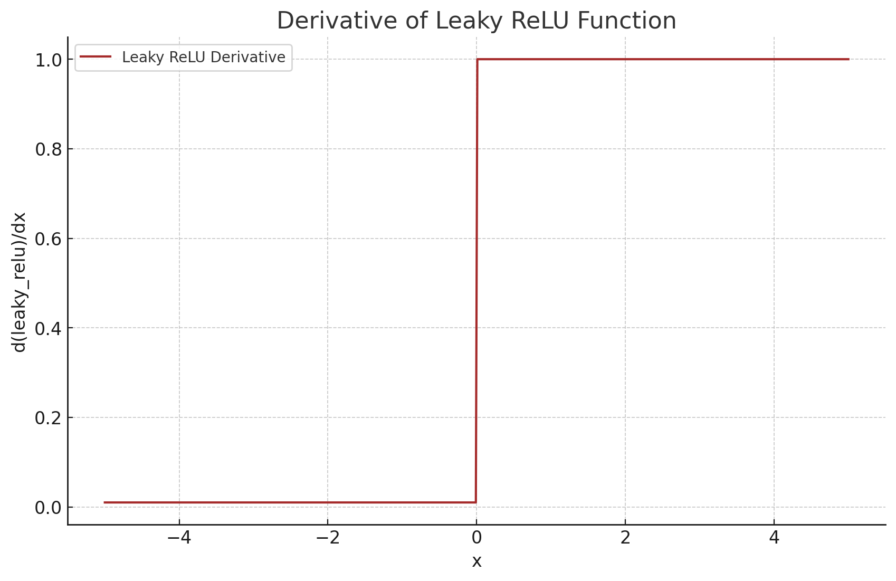

<span style="float:right;"><a href="https://github.com/RubixML/ML/blob/master/src/NeuralNet/ActivationFunctions/LeakyReLU/LeakyReLU.php">[source]</a></span>

# Leaky ReLU
Leaky Rectified Linear Units are activation functions that output `x` when x is greater or equal to 0 or `x` scaled by a small *leakage* coefficient when the input is less than 0. Leaky rectifiers have the benefit of allowing a small gradient to flow through during backpropagation even though they might not have activated during the forward pass.

$$
\text{LeakyReLU}(x) =
\begin{cases}
x & \text{if } x \geq 0 \\
\alpha x & \text{if } x < 0
\end{cases}
$$

## Parameters
| # | Name | Default | Type | Description |
|---|---|---|---|---|
| 1 | leakage | 0.1 | float | The amount of leakage as a proportion of the input value to allow to pass through when not inactivated. |

## Size and Performance
Leaky ReLU is computationally efficient, requiring only simple comparison operations and multiplication. It has a minimal memory footprint and executes quickly compared to more complex activation functions that use exponential or hyperbolic calculations. The leakage parameter allows for a small gradient when the unit is not active, which helps prevent the "dying ReLU" problem while maintaining the computational efficiency of the standard ReLU function.

## Plots




## Example
```php
use Rubix\ML\NeuralNet\ActivationFunctions\LeakyReLU;

$activationFunction = new LeakyReLU(0.3);
```

## References
[^1]: A. L. Maas et al. (2013). Rectifier Nonlinearities Improve Neural Network Acoustic Models.
