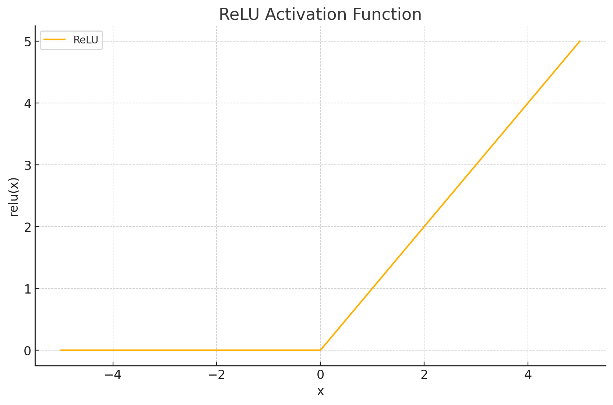
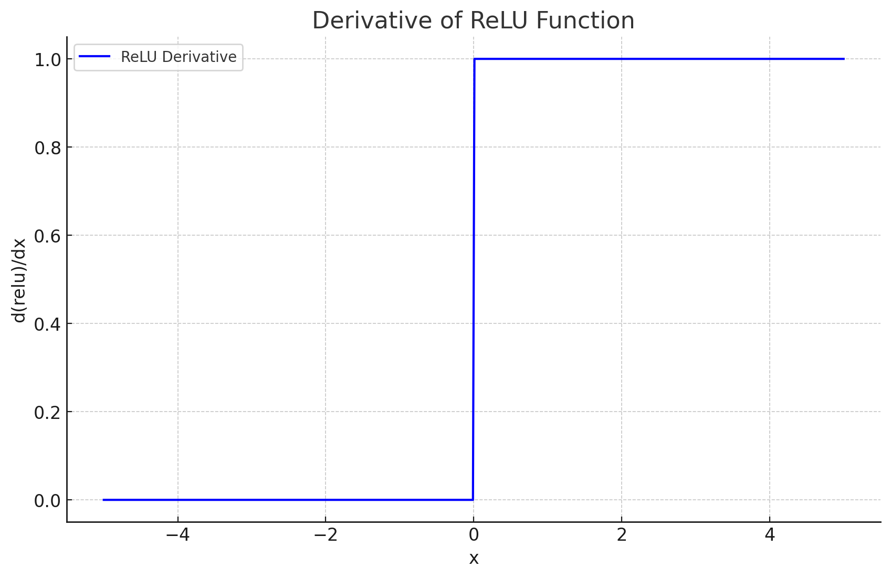

<span style="float:right;"><a href="https://github.com/RubixML/ML/blob/master/src/NeuralNet/ActivationFunctions/ReLU.php">[source]</a></span>

# ReLU
Rectified Linear Units (ReLU) only output the positive signal of the input. They have the benefit of having a monotonic derivative and are cheap to compute.

$$
{\displaystyle ReLU = {\begin{aligned}&{\begin{cases}0&{\text{if }}x\leq 0\\x&{\text{if }}x>0\end{cases}}=&\max\{0,x\}\end{aligned}}}
$$

## Parameters
This activation function does not have any parameters.

## Size and Performance
ReLU is one of the most computationally efficient activation functions, requiring only a simple comparison operation and conditional assignment. It has minimal memory requirements and executes very quickly compared to activation functions that use exponential or hyperbolic calculations. This efficiency makes ReLU particularly well-suited for deep networks with many layers, where the computational savings compound significantly.

## Plots




## Example
```php
use Rubix\ML\NeuralNet\ActivationFunctions\ReLU;

$activationFunction = new ReLU(0.1);
```

## References
[^1]: A. L. Maas et al. (2013). Rectifier Nonlinearities Improve Neural Network Acoustic Models.
[^2]: K. Konda et al. (2015). Zero-bias Autoencoders and the Benefits of Co-adapting Features.
