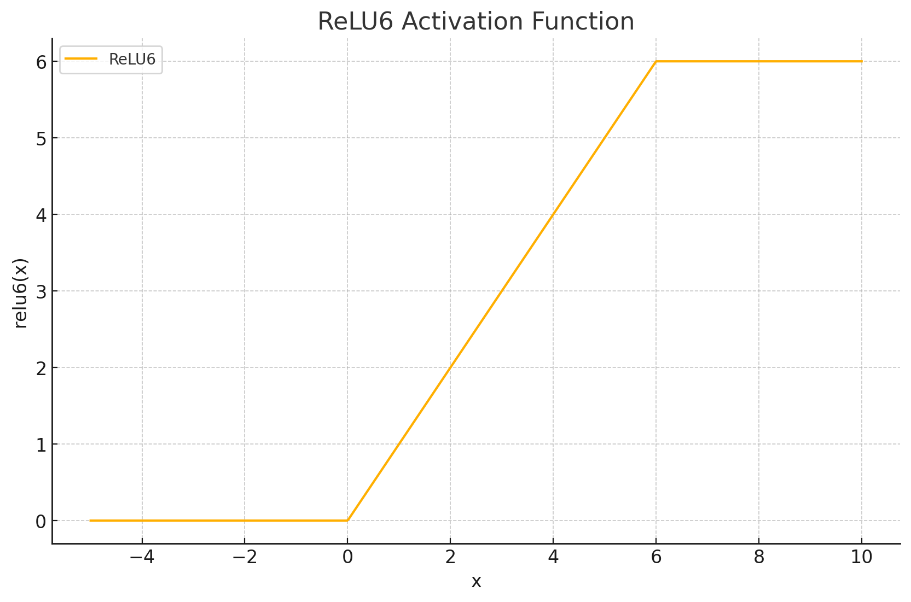
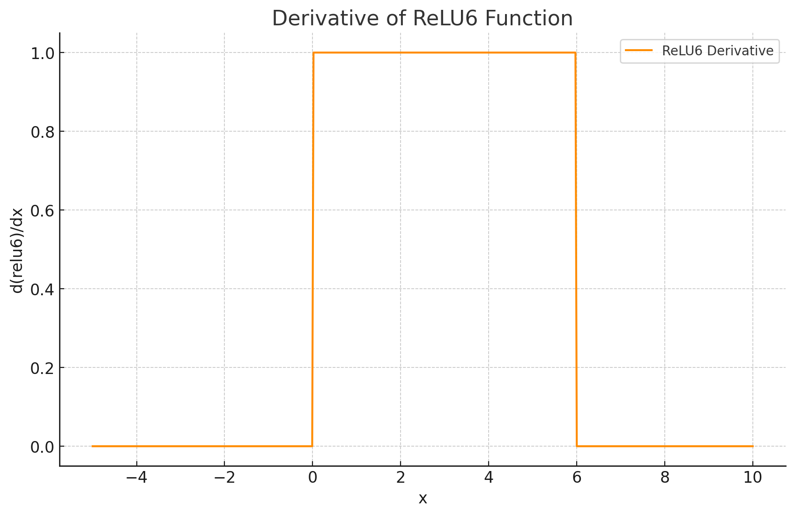

<span style="float:right;"><a href="https://github.com/RubixML/ML/blob/master/src/NeuralNet/ActivationFunctions/ReLU6/ReLU6.php">[source]</a></span>

# ReLU6
ReLU6 is a variant of the standard Rectified Linear Unit (ReLU) that caps the maximum output value at 6. This bounded ReLU function is commonly used in mobile and quantized neural networks, where restricting the activation range can improve numerical stability and quantization efficiency.

$$
\text{ReLU6}(x) = \min\left(\max(0, x), 6\right)
$$

## Parameters
This activation function does not have any parameters.

## Plots




## Example
```php
use Rubix\ML\NeuralNet\ActivationFunctions\ReLU6\ReLU6;

$activationFunction = new ReLU6();
```

