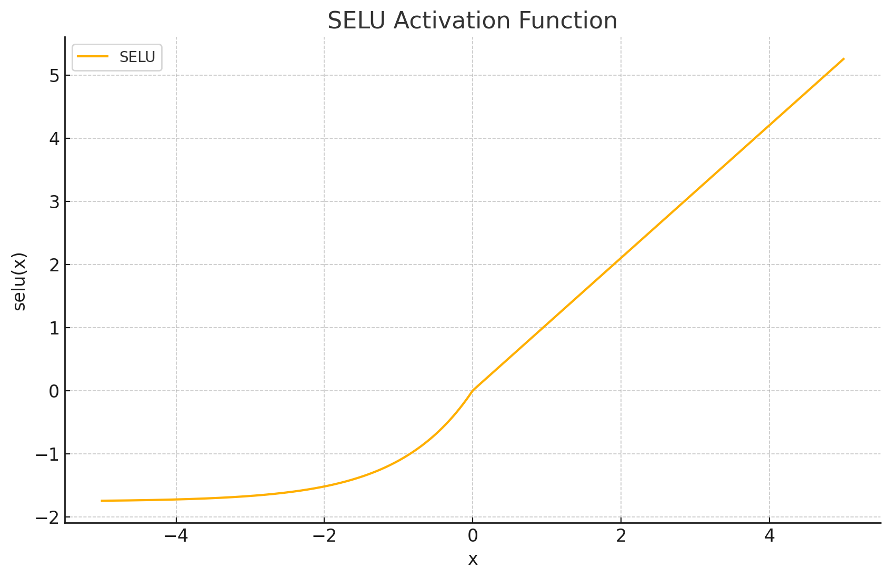
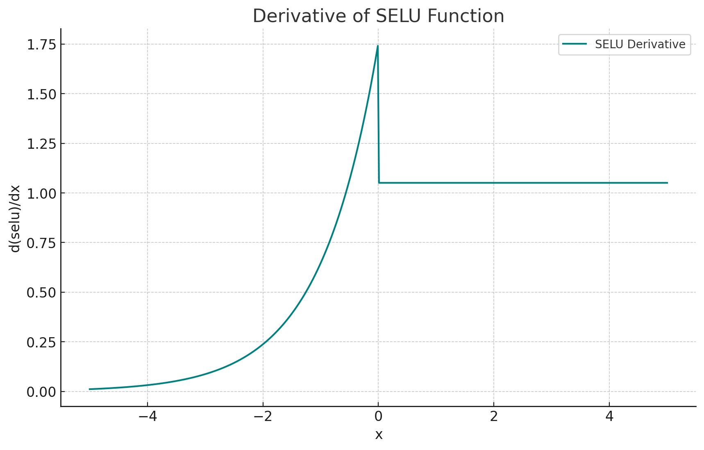

<span style="float:right;"><a href="https://github.com/RubixML/ML/blob/master/src/NeuralNet/ActivationFunctions/SELU/SELU.php">[source]</a></span>

# SELU
Scaled Exponential Linear Units (SELU) are a self-normalizing activation function based on the [ELU](#elu) activation function. Neuronal activations of SELU networks automatically converge toward zero mean and unit variance, unlike explicitly normalized networks such as those with [Batch Norm](#batch-norm) hidden layers.

$$
{\displaystyle SELU = 1.0507 {\begin{cases}1.67326 (e^{x}-1)&{\text{if }}x<0\\x&{\text{if }}x\geq 0\end{cases}}}
$$

## Parameters
This actvation function does not have any parameters.

## Size and Performance
SELU is computationally more expensive than simpler activation functions like ReLU due to its use of exponential calculations for negative inputs. However, it offers significant benefits by enabling self-normalization, which can eliminate the need for additional normalization layers like Batch Normalization. This trade-off often results in better overall network performance and potentially simpler network architectures. The self-normalizing property of SELU can lead to faster convergence during training and more stable gradients, which may reduce the total computational cost of training deep networks despite the higher per-activation computational cost.

## Plots




## Example
```php
use Rubix\ML\NeuralNet\ActivationFunctions\SELU;

$activationFunction = new SELU();
```

## References
[^1]: G. Klambauer et al. (2017). Self-Normalizing Neural Networks.
