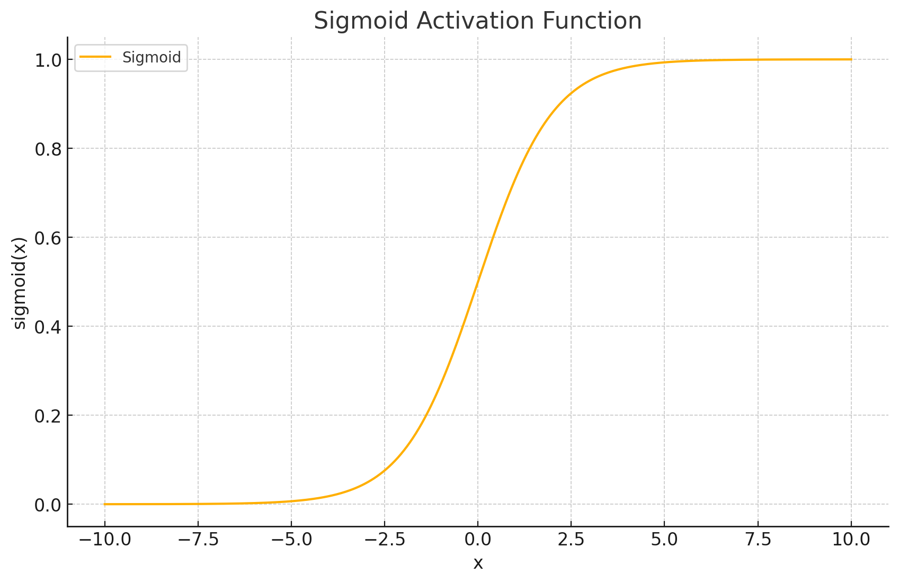
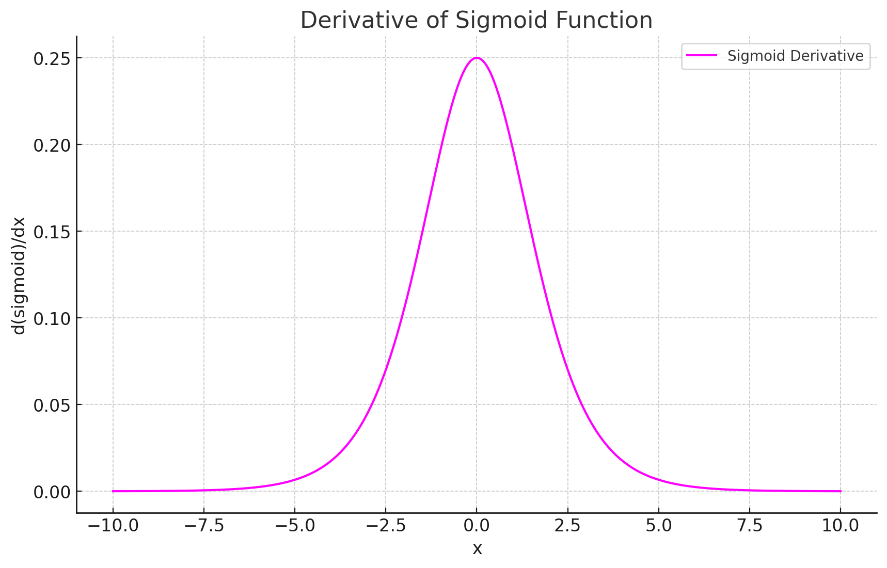

<span style="float:right;"><a href="https://github.com/RubixML/ML/blob/master/src/NeuralNet/ActivationFunctions/Sigmoid/Sigmoid.php">[source]</a></span>

# Sigmoid
A bounded S-shaped function (sometimes called the *Logistic* function) with an output value between 0 and 1. The output of the sigmoid function has the advantage of being interpretable as a probability, however it is not zero-centered and tends to saturate if inputs become large.

$$
{\displaystyle Sigmoid = {\frac {1}{1+e^{-x}}}}
$$

## Parameters
This activation function does not have any parameters.

## Size and Performance
Sigmoid is computationally more expensive than simpler activation functions like ReLU due to its use of exponential calculations. It requires computing an exponential term and a division operation for each neuron activation. For deep networks, this computational cost can become significant. Additionally, sigmoid activations can cause the vanishing gradient problem during backpropagation when inputs are large in magnitude, potentially slowing down training. Despite these limitations, sigmoid remains valuable in output layers of networks performing binary classification or when probability interpretations are needed.

## Plots




## Example
```php
use Rubix\ML\NeuralNet\ActivationFunctions\Sigmoid;

$activationFunction = new Sigmoid();
```
