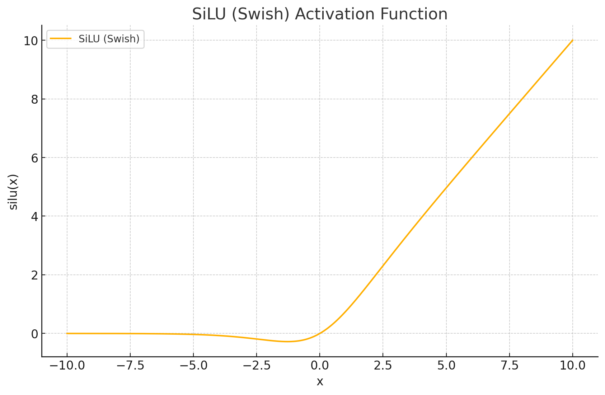
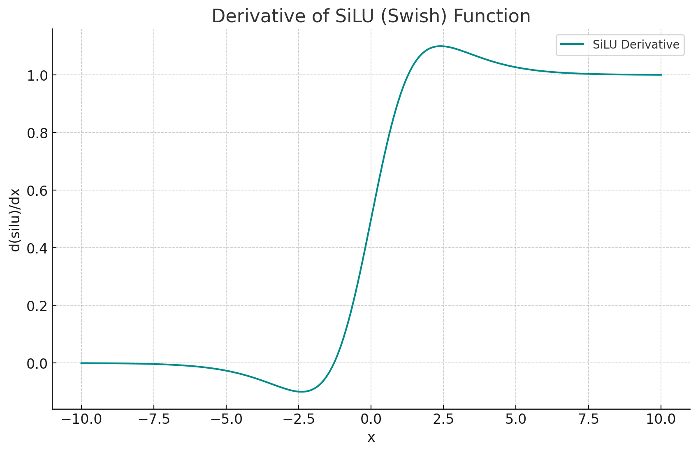

<span style="float:right;"><a href="https://github.com/RubixML/ML/blob/master/src/NeuralNet/ActivationFunctions/SiLU/SiLU.php">[source]</a></span>

# SiLU
Sigmoid Linear Units are smooth and non-monotonic rectified activation functions. Their inputs are weighted by the [Sigmoid](sigmoid.md) activation function acting as a self-gating mechanism.

## Parameters
This activation function does not have any parameters.

## Size and Performance
SiLU is computationally more expensive than simpler activation functions like ReLU due to its use of exponential calculations from the sigmoid component. Each activation requires computing an exponential term and a division operation. However, SiLU offers improved performance in deep learning models, particularly in computer vision and natural language processing tasks, which can justify the additional computational cost. The smooth, non-monotonic nature of SiLU helps with gradient flow during training, potentially leading to faster convergence and better overall model performance despite the higher per-activation computational cost.

## Plots




## Example
```php
use Rubix\ML\NeuralNet\ActivationFunctions\SiLU;

$activationFunction = new SiLU();
```

### References
[^1]: S. Elwing et al. (2017). Sigmoid-Weighted Linear Units for Neural Network Function Approximation in Reinforcement Learning.
