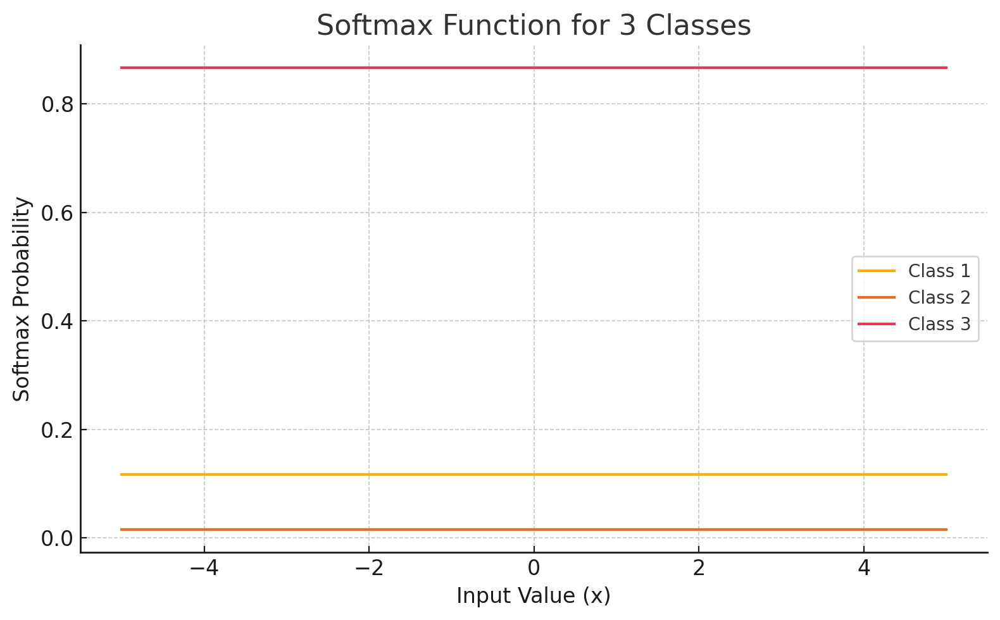
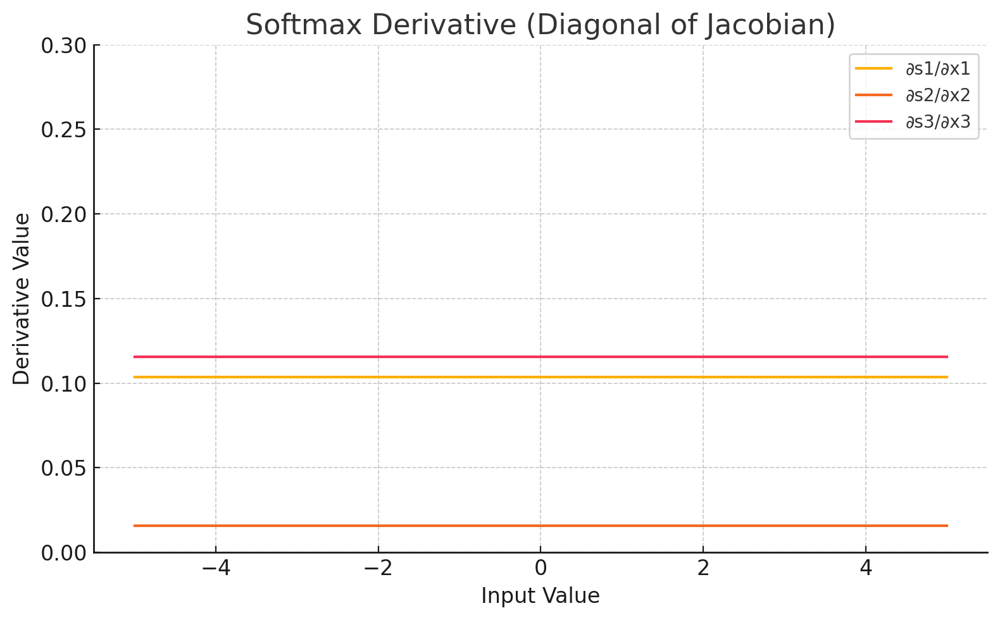

<span style="float:right;"><a href="https://github.com/RubixML/ML/blob/master/src/NeuralNet/ActivationFunctions/Softmax/Softmax.php">[source]</a></span>

# Softmax
The Softmax function is a generalization of the [Sigmoid](sigmoid.md) function that squashes each activation between 0 and 1 with the addition that all activations add up to 1. Together, these properties allow the output of the Softmax function to be interpretable as a *joint* probability distribution.

$$
{\displaystyle Softmax = {\frac {e^{x_{i}}}{\sum _{j=1}^{J}e^{x_{j}}}}}
$$

## Parameters
This activation function does not have any parameters.

## Size and Performance
Softmax is computationally more expensive than many other activation functions due to its need to process all neurons in a layer collectively rather than independently. It requires exponential calculations for each neuron, followed by a normalization step that involves summing all exponential values and dividing each by this sum. This creates a computational dependency between all neurons in the layer. Despite this cost, Softmax is essential for multi-class classification output layers where probability distributions are required. The implementation uses optimized matrix operations to improve performance, but the computational complexity still scales with the number of neurons in the layer.

## Plots




## Example
```php
use Rubix\ML\NeuralNet\ActivationFunctions\Softmax;

$activationFunction = new Softmax();
```
