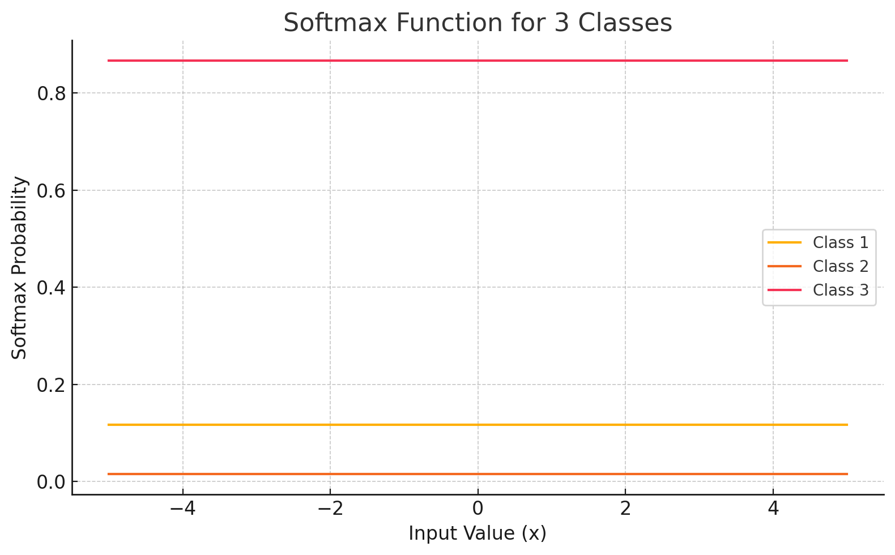
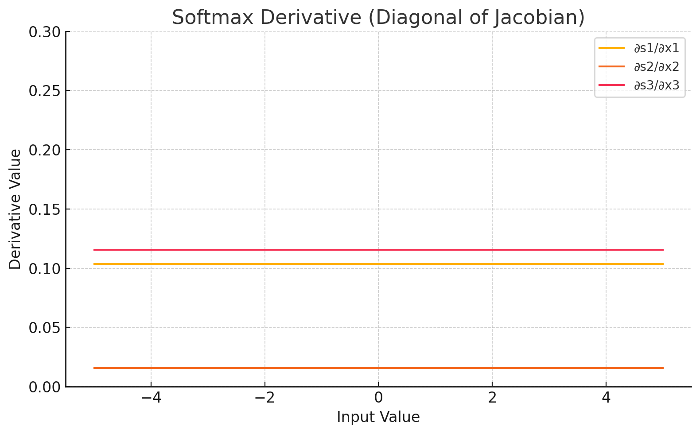

<span style="float:right;"><a href="https://github.com/RubixML/ML/blob/master/src/NeuralNet/ActivationFunctions/Softmax.php">[source]</a></span>

# Softmax

The Softmax function is a generalization of the [Sigmoid](sigmoid.md) function that squashes each activation between 0 and 1 with the addition that all activations for each sample add up to 1. Together, these properties allow the output of the Softmax function to be interpretable as a *joint* probability distribution for multiclass classification.

Softmax expects batched network activations in `[classes, batch]` layout, where rows represent classes and columns represent samples. Each sample column is normalized independently.

$$
\text{Softmax}(x_i) = \frac{e^{x_i}}{\sum_{j=1}^{n} e^{x_j}}
$$

Where:

- 𝑥𝑖 is the i-th element of the input vector
- 𝑛 is the number of elements in the vector
- The denominator ensures the outputs sum to 1

## Parameters

This activation function does not have any parameters.

## Plots




## Example

```php
use Rubix\ML\NeuralNet\ActivationFunctions\Softmax;

$activationFunction = new Softmax();
```
