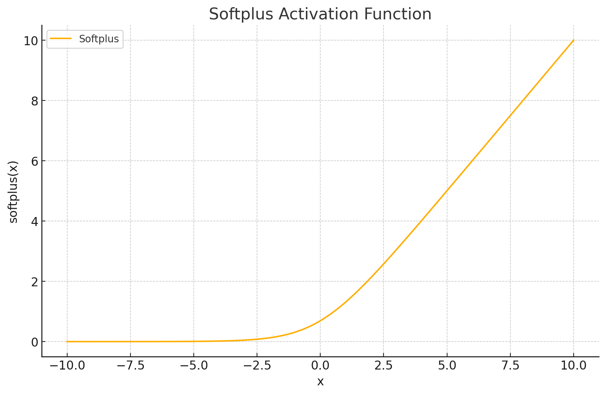
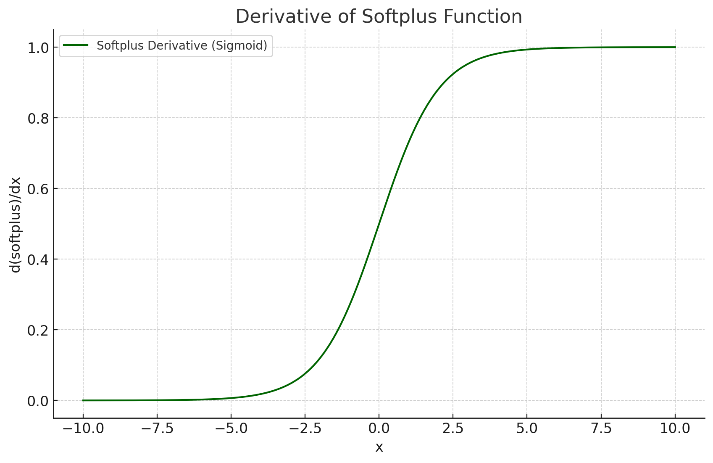

<span style="float:right;"><a href="https://github.com/RubixML/ML/blob/master/src/NeuralNet/ActivationFunctions/Softplus/Softplus.php">[source]</a></span>

# Softplus
A smooth approximation of the piecewise linear [ReLU](relu.md) activation function.

$$
{\displaystyle Softplus = \log \left(1+e^{x}\right)}
$$

## Parameters
This activation function does not have any parameters.

## Plots




## Example
```php
use Rubix\ML\NeuralNet\ActivationFunctions\Softplus\Softplus;

$activationFunction = new Softplus();
```

## References
[1]: X. Glorot et al. (2011). Deep Sparse Rectifier Neural Networks.
