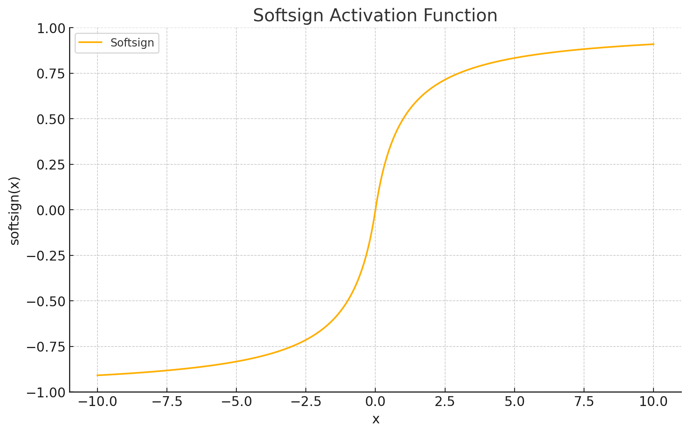
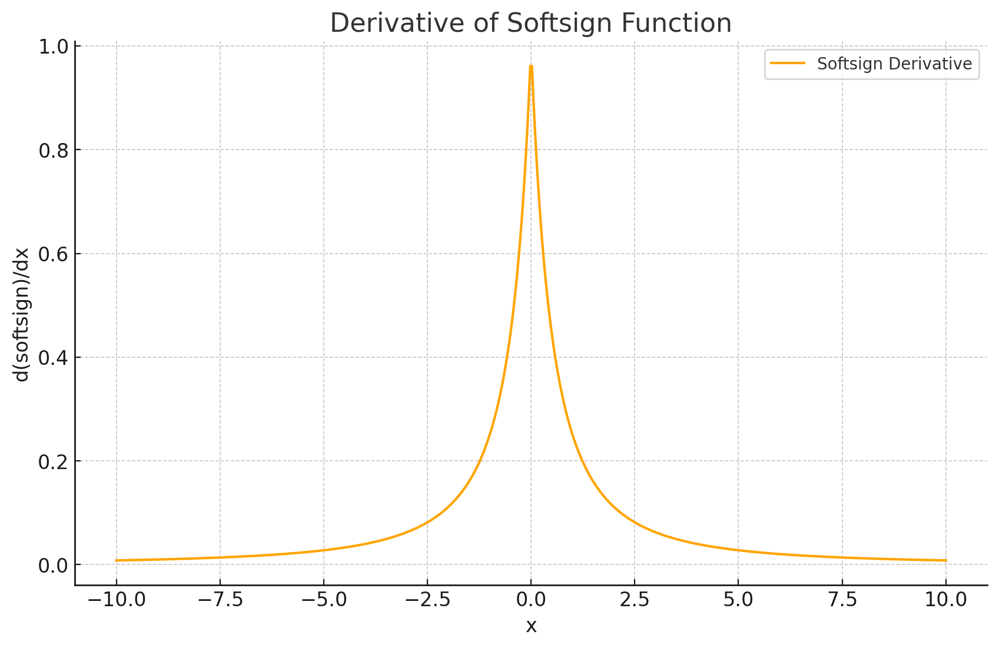

<span style="float:right;"><a href="https://github.com/RubixML/ML/blob/master/src/NeuralNet/ActivationFunctions/Softsign/Softsign.php">[source]</a></span>

# Softsign
A smooth sigmoid-shaped function that squashes the input between -1 and 1.

$$
{\displaystyle Softsign = {\frac {x}{1 + |x|}}}
$$

## Parameters
This activation function does not have any parameters.

## Size and Performance
Softsign is computationally more efficient than functions that use exponential calculations (like Sigmoid or Tanh), as it only requires an absolute value operation and basic arithmetic. However, it is slightly more expensive than ReLU due to the division operation. Softsign has the advantage of not saturating as quickly as Tanh, which can help with the vanishing gradient problem in deep networks. The smoother gradients of Softsign can lead to more stable training dynamics, though this comes at a small computational cost compared to simpler activation functions.

## Plots




## Example
```php
use Rubix\ML\NeuralNet\ActivationFunctions\Softsign;

$activationFunction = new Softsign();
```

## References
[^1]: X. Glorot et al. (2010). Understanding the Difficulty of Training Deep Feedforward Neural Networks.
