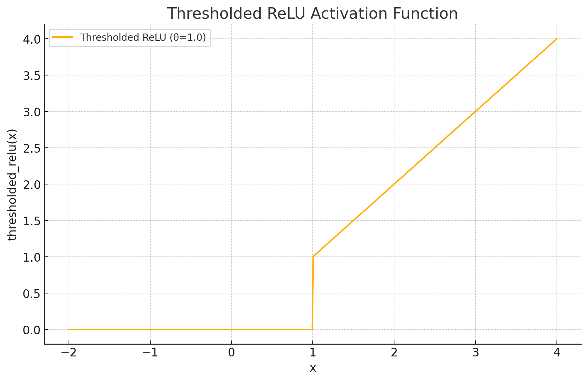
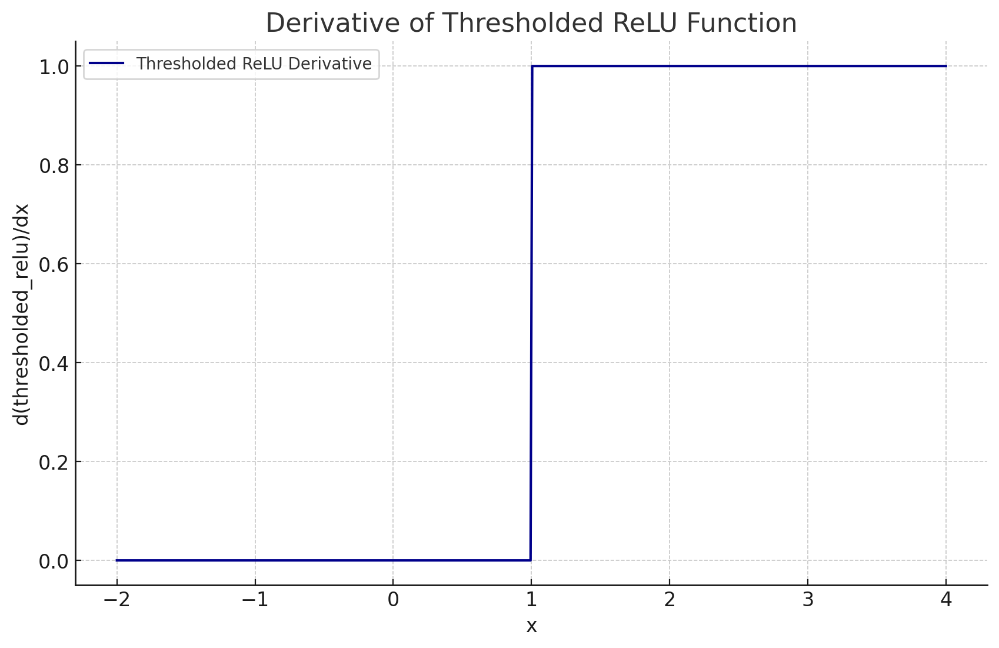

<span style="float:right;"><a href="https://github.com/RubixML/ML/blob/master/src/NeuralNet/ActivationFunctions/ThresholdedReLU/ThresholdedReLU.php">[source]</a></span>

# Thresholded ReLU
A version of the [ReLU](relu.md) function that activates only if the input is above some user-specified threshold level.

$$
\text{ThresholdedReLU}(x) =
\begin{cases}
x & \text{if } x > \theta \\
0 & \text{if } x \leq \theta
\end{cases}
$$

## Parameters
| # | Name | Default | Type | Description |
|---|---|---|---|---|
| 1 | threshold | 1.0 | float | The threshold at which the neuron is activated. |

## Plots




## Example
```php
use Rubix\ML\NeuralNet\ActivationFunctions\ThresholdedReLU\ThresholdedReLU;

$activationFunction = new ThresholdedReLU(2.0);
```

## References
[1]: K. Konda et al. (2015). Zero-bias autoencoders and the benefits of co-adapting features.
